Sarff 
============

-------------------     ----------------------------
#E-mail:                        exehoua@gmail.com  
#Telegram:                      [@sarffgufer](https://t.me/sarffgufer)    
#Web:                           https://itdim.com.ua/   
Codewars:                      https://www.codewars.com/users/sarff  
Freelance:                     https://freelancehunt.com/freelancer/itdim.html 
Fiver:                         [https://www.fiverr.com/dmytrofeo](https://www.fiverr.com/pe/Gvy2Kz)   
UpWork:                        [https://www.upwork.com/](https://www.upwork.com/freelancers/~01225ceb9ceadb4d2c?mp_source=share) 
-------------------     ----------------------------

Education
---------

2007 
:   **Enhanced SQL course

    *Have experience from complex queries and temporary tables to building a database from scratch (from index to trigger)*

2019
:   **Python разработка - с нуля до профессионала. Python 3

    https://www.udemy.com/share/101GkA3@HqrszNozMEDBvksuEaFOCyk6Y9bUOzhtwxDN7wKHEp4OmGl7dJVmm8gEO0lAF6lY/
    
2020
:   **Learn Python Programming Masterclass

    https://www.udemy.com/share/101Wai3@uz_ioUpdiUCgjA6Vjglfy8-iiAboobHq-m55ICNsDAkQGyL18qPx5879krbG6FMn/

2022
:   **Learn Go Programming Masterclass

    https://stepik.org/cert/1559142

2024
:   **Learn Go Programming Masterclass

    https://prjctr.com/certificate/01HZ80MTZDJQVH6F2HWCMPRGWP?_gl=1*1m1vzt1*_gcl_au*MjU4MDI5NzAzLjE3MzUxMzE0ODQ.*_ga*MTM2OTczNjM0My4xNzM1MTMxNDg0*_ga_2MPTSBFM6Q*MTczNTEzMTQ4My4xLjEuMTczNTEzMTQ5NC40OS4wLjM5MTgwMDc0Mw

2025
:   **Golang for developers

    https://lms.robotdreams.cc/certificate/8c72160272a083e18bee2d6b1a256a8b

Experience
----------

   * Experience as a 1C programmer; Head of IT department;
   * Experience in development and implementation of products from scratch (retail sales, CRM, CPA, Payments gateway etc.)
   * Experience in interacting and implementing various API, payments systems

Technical Experience
--------------------
  * See my Github 
  * Logging package https://github.com/sarff/iSlogger
  * GO development - Telegram bot (parser, bigdata analyse) https://t.me/kenomsl_bot
  * GO development - Telegram bot (roles, crm api, sheduler etc) https://t.me/Maystry_bot
  * GO development - website https://itdim.com.ua/
  * Trading bot written in Python using (Docker, Celery, PostgreSQL, Flask, Binance API etc) https://t.me/AutoCryptoTrade_Binance

----------------------------------------

* Human Languages:

     * English 
     * Ukranian (native speaker)
----------------------------------------

## 📆 Half-year activity calendar

  

## My badges Holopin

